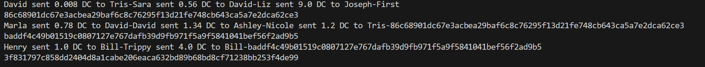

# DaveCoin Blockchain

This Python script implements a simple blockchain using the `DaveCoin` class. Each block in the blockchain contains information about the previous block, a list of transactions, and a hash value.

## Usage

1. Run the script using Python.

   ```bash
   python main.py
   ```
## Classes and Methods
### DaveCoin Class
Attributes:
- previous_block: Hash of the previous block.
- transactions: List of transactions in the block.
- block_data: Combined string of transactions and previous block hash.
- block_hash: SHA-256 hash of the block data.

Methods:
- calculate_hash(): Calculates the SHA-256 hash of the block data.

## Sample Transactions
Transactions are represented as dictionaries with the following keys:

- sender: The sender's name.
- amount: The amount of DaveCoins sent.
- receiver: The receiver's name.

### Example:
```bash
trans_1 = {"sender": "David", "amount": 0.008, "receiver": "Tris"}
```
## Output


Feel free to customize and extend the code for your blockchain implementation.


This README provides information on how to use the script, details about the `DaveCoin` class, its attributes and methods, and a sample transaction format.
